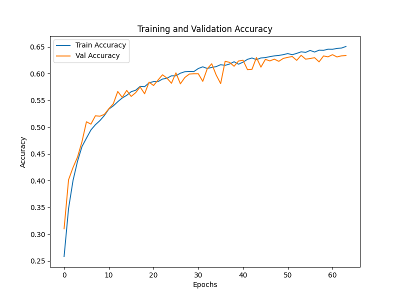

# Vision Transformer (ViT) on CIFAR-10

This project implements a Vision Transformer (ViT) model for image classification on the CIFAR-10 dataset. The model is built using PyTorch and trained to classify images into 10 different categories.

## Dataset
The CIFAR-10 dataset consists of 60,000 32x32 color images in 10 classes, with 6,000 images per class. There are 50,000 training images and 10,000 test images.

## Project Structure

- `data.py`: Contains functions for loading and preprocessing the CIFAR-10 dataset.
- `model.py`: Defines the Vision Transformer architecture.
- `train.py`: Implements the training loop, validation, and testing procedures.

## Vision Transformer Overview

The Vision Transformer (ViT) is an adaptation of the Transformer architecture, originally designed for natural language processing tasks, to computer vision problems. The key idea behind ViT is to treat an image as a sequence of patches and process it similarly to how a Transformer processes a sequence of words.

Here's a brief overview of how Vision Transformers work:

1. Image Patching: The input image is divided into fixed-size patches (e.g., 4x4 or 16x16 pixels).
2. Linear Embedding: Each patch is flattened and linearly embedded to a fixed-size vector.
3. Position Embedding: Learnable position embeddings are added to provide spatial information.
4. Transformer Encoder: The embedded patches are processed through multiple layers of self-attention and feed-forward networks.
5. Classification Token: A special classification token is prepended to the sequence of embedded patches and used for the final classification.
6. MLP Head: The final hidden state corresponding to the classification token is fed into a Multi-Layer Perceptron (MLP) head to produce class predictions.

## Model Architecture

The Vision Transformer model in this project consists of:
- Patch Embedding layer
- Transformer Encoder blocks
- MLP Head for classification

The total number of trainable parameters in this setup is approximately 6.5 million.

## Training

The model is trained using the following hyperparameters:

- Batch Size: 64
- Learning Rate: 5e-4
- Epochs: 200 (with early stopping)
- Optimizer: Adam
- Learning Rate Scheduler: CosineAnnealingLR
- Weight Decay: 5e-4

Early stopping is implemented with a patience of 10 epochs to prevent overfitting and reduce training time.

## Results
After training. the model achieved the following performance:

The final test accuracy: 62.57%

## Future Improvements

The current implementation has not yet been fully optimized. Future work could focus on:
1. Further hyperparameter tuning to improve model accuracy and generalization.
2. Experiment with different model architectures and regularization techniques.
3. Implement data augmentation techniques to improve generalization.

## Dependencies
- matplotlib
- numpy
- Pillow
- torch
- torchvision
- tqdm

## References

- **An Image is Worth 16x16 Words: Transformers for Image Recognition at Scale**, Dosovitskiy, A., et al. (2020). [arXiv:2010.11929](https://arxiv.org/abs/2010.11929)
- **Learning Multiple Layers of Features from Tiny Images**. Krizhevsky, A. (2009).

